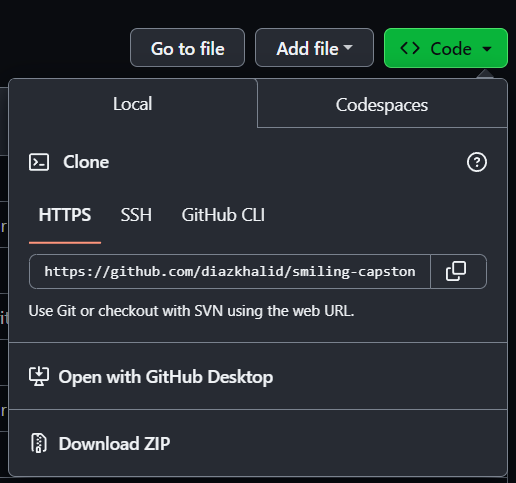
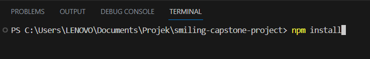
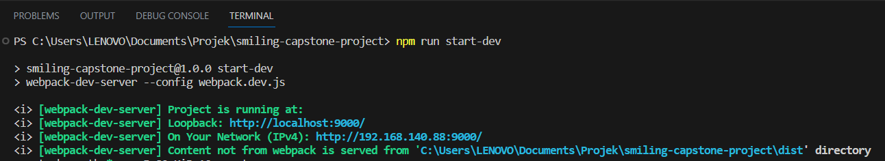
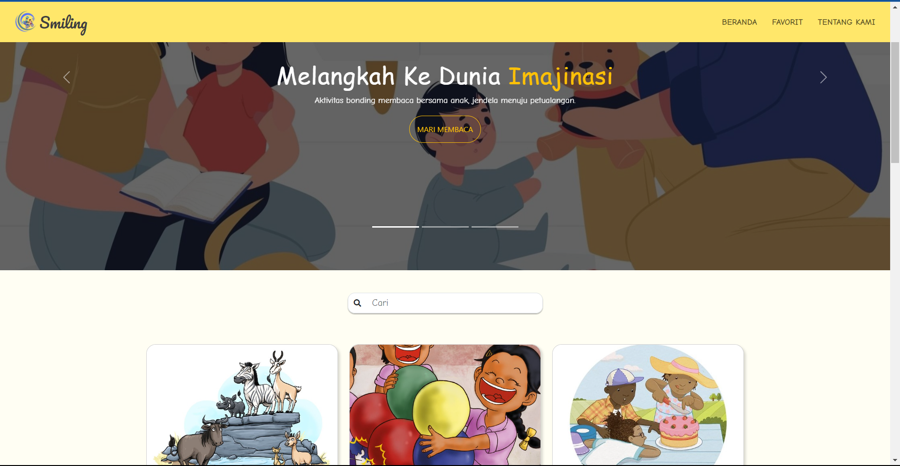
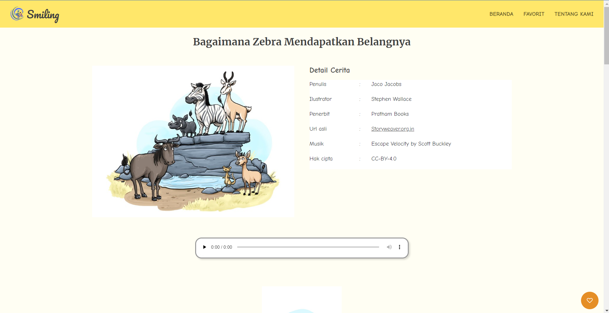
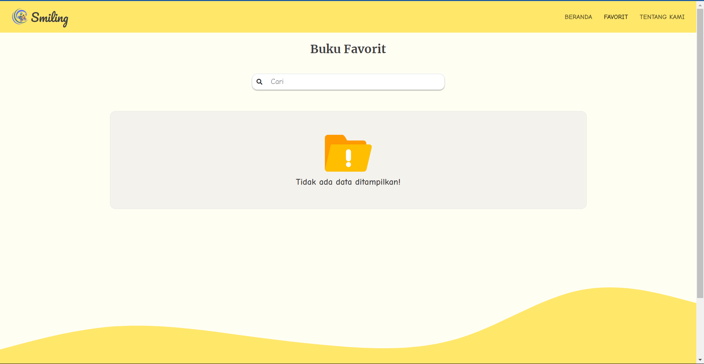
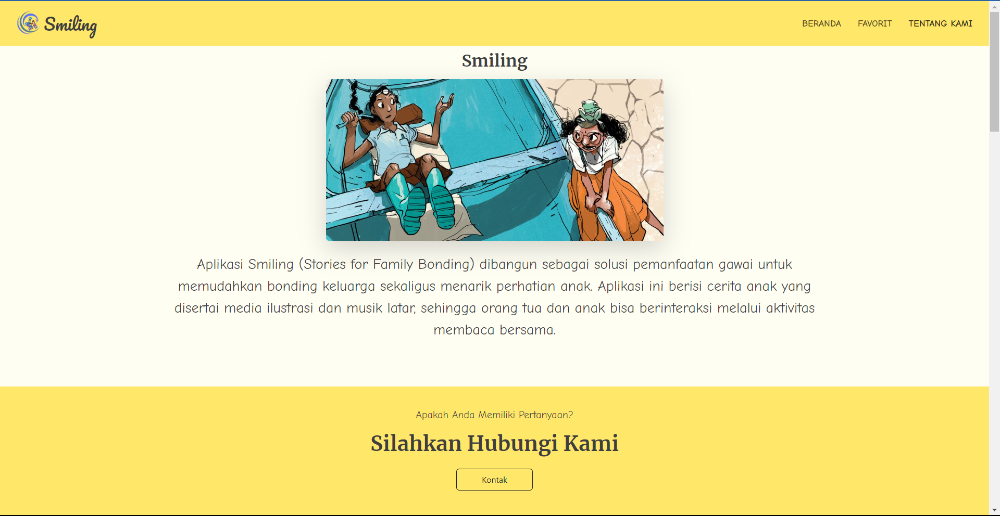

# Smiling (Stories for Family Bonding)

Aplikasi Smiling (Stories for Family Bonding) dibangun sebagai solusi pemanfaatan gawai untuk memudahkan bonding keluarga sekaligus menarik perhatian anak.     Aplikasi ini berisi cerita anak yang disertai media ilustrasi dan musik latar, sehingga orang tua dan anak bisa berinteraksi melalui aktivitas membaca bersama.

## Cara Penggunaan
#### 1. Download File   Langkah pertama yaitu mendownload file dengan menekan tombol <b>Code</b> Kemudian menekan tombol <b>Download Zip</b> kemudian buka foler di text editor anda    
  
#### 2. Menginstal Dependensi   Langkah kedua yaitu menginstall seluruh depedensi yang ada dalam proyek package.json dengan cara menulis pada terminal <b>Npm install</b>   
  
#### 3. Menjalankan Aplikasi   Langkah ketiga yaitu menjalankan aplikasi dengan cara menulis pada terminal <b>Npm run start-dev</b>   

## Tampilan Aplikasi
#### 1. Halaman Beranda   

#### 2. Halaman Detail   

#### 3. Halaman Favorite   

#### 4. Halaman Tentang Kami   

## Dokumentasi API
* Untuk Dokumentasi API dari Aplikasi Smiling ini bisa akess link berikut:  
  Dokuemntasi API : [Smiling_API](https://smiling-api-docs.netlify.app/#/)

## Team
#### 1. [Fahru Alfarizi Hananza Putrawan](https://www.linkedin.com/in/fahru-alfarizi-hananza-putrawan-94379b26a/)| UNIVERSITAS MATARAM | `F009XA014`

#### 2. [Diaz Khalid Ananda](https://www.linkedin.com/in/diaz-khalid-ananda-5a135a267/)| UNIVERSITAS MATARAM | `F009XA017`

#### 3. [I Gusti Agung Ngurah Oka Devara Jelantik](https://www.linkedin.com/in/okadevara/)| ITB STIKOM BALI | `F060XA154`

#### 4. [I Made Adi Sukma Meta](https://www.linkedin.com/in/adi-sukma-a5485b176/)| ITB STIKOM BALI | `F060XA084`

### Bahasa Pemrograman dan Tools
[][webdev]
[][webdev]
[][webdev]
[][webdev]
[][webdev]
[][webdev]

 
 

[webdev]: https://github.com/fahrual/fahrual
